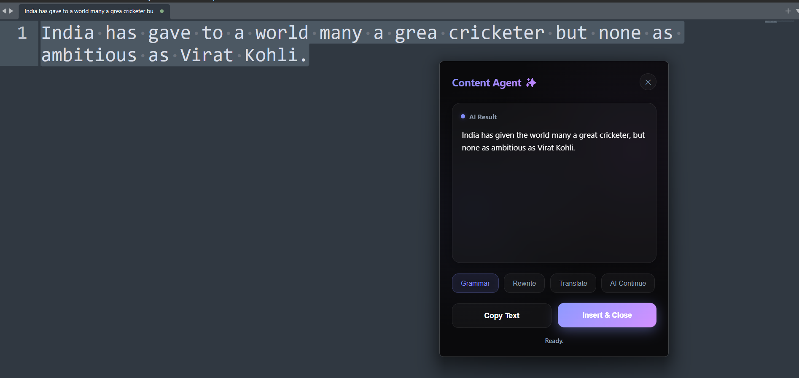
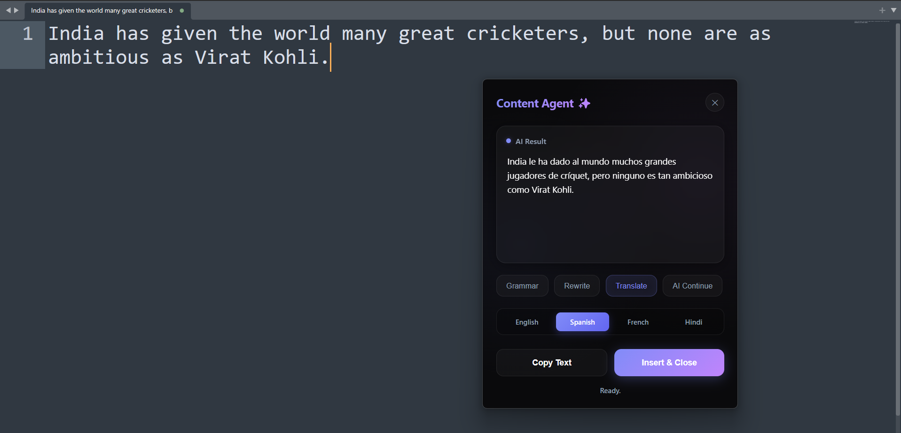
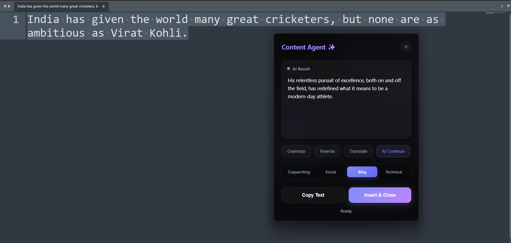

# AI Content Agent

A floating AI writing assistant for Windows. Select text, press a global hotkey, and a desktop widget appears that uses an LLM to rewrite, check grammar, translate, or generate the next line of your content natively.

## Features
- **Global Hotkeys:** Works globally anywhere across the OS.
- **Frameless Widget UI:** A sleek, dark-themed, glassmorphic UI built natively utilizing `pywebview` chromium hooking for an app-like feel.
- **Intelligent Processing**
  - **Grammar Check**: Polishes text while retaining your precise original meaning.
  - **Rewrite / Alternatives**: Restructures context clearly to provide a different readable flow.
  - **Translate**: AI translations preserving formatting.
  - **AI Continue / Generate Next Line**: Programmed exclusively across 4 behavioral sub-modes:
    - *Copywriting*: Persuasive, action-oriented for engagement.
    - *Social*: Short, punchy, casual for social media.
    - *Blog*: Informative, structured, storytelling nature.
    - *Technical*: Precise, professional, structured.
- **Copy & Auto-Replace**: Programmatically injects the generated AI text straight into your computer's clipboard to seamlessly replace your selected text logic in any program.

---

## 1. Grammar:



##  2. Translation:



## 3. Generate next line:




## Technologies

- **Python 3+**
- **gemini-2.5-flash**
- **Flask**
- **PyWebview** (Native Desktop window bridging)
- **Keyboard** & **Pyperclip** (Low-level Windows keyboard hooking and OS clipboard scraping)

---

## Installation

1. **Clone the repository and jump to the directory:**
```cmd
cd content-agent
```

2. **Establish a virtual environment (optional but recommended):**
```cmd
python -m venv venv
venv\Scripts\activate
```

3. **Install Dependencies:**
```cmd
pip install -r requirements.txt
```

4. **Environment Configuration:**
Create a `.env` file in the root directory. Paste your Google Gemini API key:
```env
GEMINI_API_KEY="your_api_key_here"
```

##  Running Locally

Simply run the application from your terminal:
```cmd
python app.py
```
> *The application will start silently. You will not see a window immediately. It operates entirely based on OS interrupts via the keyboard.*

### Using the Assistant:
1. Drag your mouse to highlight ANY text inside a browser, Notepad, Word, Discord, etc.
2. Press **`CTRL` + `ALT` + `W`** to summon the application.
3. The UI will pop open, scraping your selected text automatically.
4. Interact with the AI features, and click "Insert & Close" to drop the text natively back into your document.

---