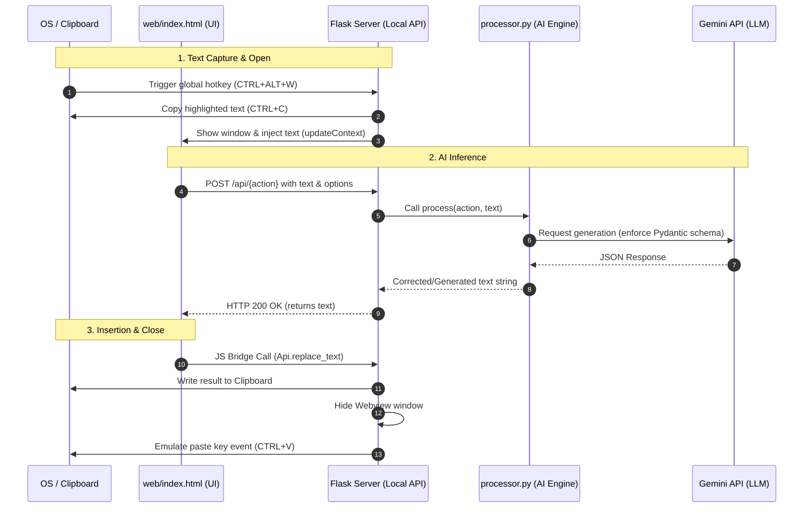

# AI Content Agent Flow

A simplified, step-by-step overview of how the AI Content Agent works under the hood.

---

## 1. High-Level Technical Flow

The application coordinates OS-level hook listeners, an embedded GUI window, a local HTTP server, and the Gemini API.

### Technical Lifecycle Explanation

1. **Trigger & Scrape**: A global keyboard hook in the Python backend intercepts `CTRL` + `ALT` + `W`. It instantly mimics a standard copy command (`CTRL` + `C`) to grab highlighted text from the active OS application into the clipboard, then reads it into memory.
2. **Display Window**: The backend opens the Webview container, centers it, and injects the text via a JS-evaluated function call (`updateContext`).
3. **HTTP API Call**: The frontend sends an HTTP POST request to the local Flask API (port `3000`) with parameters defining the tab function and options (e.g., mode, language).
4. **Structured Inference**: The local API invokes the AI engine. The engine selects the appropriate system prompt, enforces a Pydantic schema config for validation, and calls the Google Gemini API.
5. **Payload Insertion**: When inserting the text, the frontend calls a Python function exposed via the PyWebview API bridge. The backend updates the clipboard, hides the UI window, sleeps briefly to let the OS switch focus back to the target app, and emulates a native paste event (`CTRL` + `V`).

---

## 2. Main Execution Cycle

The application runs in three parallel blocks: a **main GUI thread**, a **hotkey listener**, and a **local Flask server**. Here is how a single run cycle behaves:

### Step 1: Text Capture
*   The application listens globally for the **`CTRL` + `ALT` + `W`** keyboard interrupt.
*   Once triggered, it emulates a `CTRL` + `C` keystroke, scraping whatever text is highlighted in your browser, word processor, or code editor, and caches it.

### Step 2: Widget Display
*   The application launches a native webview container pointing to `web/index.html`.
*   The window is centered on the user's primary monitor dynamically.
*   The captured text is injected directly into the HTML textarea input field.

### Step 3: AI Inference
*   When the user selects an operation (e.g., Rewrite) and clicks **"Generate Intelligence"**, the frontend sends a POST request to the local Flask server on port `3000`.
*   The backend routes the request to `Processor.process` (in `processor.py`).
*   The processor pulls the respective prompt context from `prompts.py` and sends it to the Gemini API (`gemini-2.5-flash`).
*   Structured outputs are enforced by Pydantic models from `models.py`. The model response is sent back to the HTML textarea.

### Step 4: Text Replacement
*   When the user clicks **"Insert & Close"**, the frontend invokes a native Python method exposed via the native JS-Python bridge `Api` (in `app.py`).
*   The backend copies the new text to the clipboard, hides the UI window, pauses briefly to let the original application regain focus, and simulates a **`CTRL` + `V`** keyboard event to paste the final result directly over the user's initial selection.

---

## 3. Project File Roles

| File | Location | Role |
| :--- | :--- | :--- |
| `app.py` | Root | Bootstraps the application, hooks global hotkeys, handles native window positioning, and hosts the API endpoints. |
| `processor.py` | Root | Interacts with the Google Gemini API client and coordinates prompts. |
| `models.py` | Root | Formulates structural constraints (Pydantic schemas) to guarantee clean JSON replies from the Gemini model. |
| `prompts.py` | Root | Holds system prompt instruction templates. |
| `constants.py` | Root | Stores operational hyper-parameters like temperatures, model tags, and key imports. |
| `routes.py` | Root | Declares routing paths for API requests. |
| `index.html` | `web/` | The modern CSS/HTML frontend page shown inside the desktop webview. |
